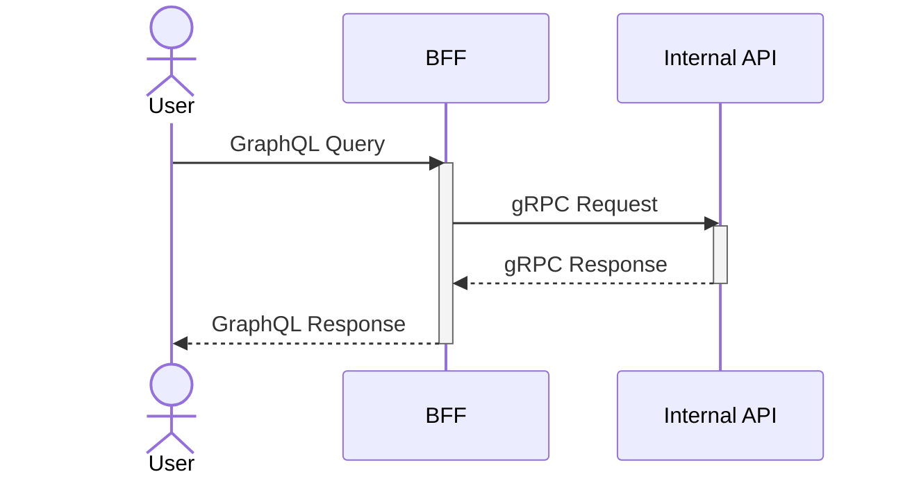

# Kotlin Backends

## Overview

This repository contains backend services written in Kotlin, including BFF (Backend for Frontend) and internal gRPC APIs. It serves as a foundation for building modular and scalable backend systems.

## Modules

- BFF
  - Ktor
  - graphql-kotlin
- Internal API
  - grpc-kotlin

## Integration Flow

This diagram illustrates the communication flow between services:
1. User sends GraphQL queries to BFF
2. BFF transforms the queries into gRPC requests
3. Internal API processes the requests and returns responses via gRPC
4. BFF converts the gRPC responses back to GraphQL format and returns to the user

## Playground

1. Start Internal API
2. Start BFF
3. Access GraphiQL at http://localhost:8080/graphiql

GraphQL endpoint is available at http://localhost:8080/graphql
