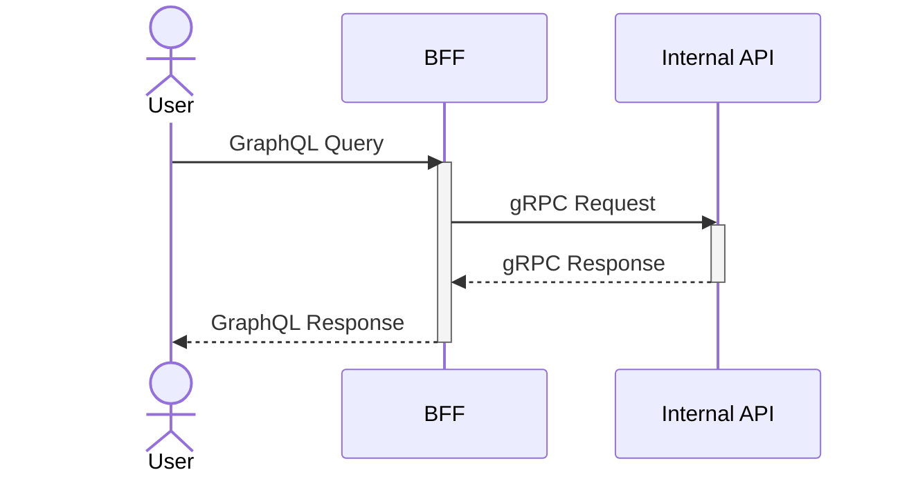

# Kotlin Backends

## Overview

This repository contains a modular backend system built with Kotlin, featuring a microservices architecture with GraphQL and gRPC integration. The system consists of a BFF (Backend for Frontend) service that exposes GraphQL APIs and an internal gRPC service for business logic processing.

## Architecture

### Services

- **BFF (Backend for Frontend)**
  - Built with [Ktor](https://ktor.io/) web framework
  - GraphQL server using [graphql-kotlin](https://expediagroup.github.io/graphql-kotlin/)
  - Acts as an API gateway, translating GraphQL queries to gRPC calls
  - Runs on port 8080

- **Internal API**
  - gRPC server built with [grpc-kotlin](https://github.com/grpc/grpc-kotlin)
  - Handles business logic and data processing
  - Runs on port 50051
  - Includes Protocol Buffer definitions for service contracts

- **Database Layer**
  - PostgreSQL with read/write separation
  - [Exposed](https://github.com/JetBrains/Exposed) ORM for database operations
  - Writer instance on port 5432, Reader instance on port 5433

### Technology Stack

- **Language**: Kotlin 2.1.10 with JVM 21
- **Build System**: Gradle with Kotlin DSL
- **Web Framework**: Ktor 3.1.3
- **GraphQL**: graphql-kotlin 9.0.0-alpha.8
- **gRPC**: grpc-kotlin 1.4.3
- **Database**: PostgreSQL 17.5 with Exposed 0.61.0
- **Testing**: Kotest 5.9.1
- **Containerization**: Docker with multi-stage builds

## Integration Flow

This diagram illustrates the communication flow between services:
1. User sends GraphQL queries to BFF
2. BFF transforms the queries into gRPC requests
3. Internal API processes the requests and returns responses via gRPC
4. BFF converts the gRPC responses back to GraphQL format and returns to the user



## Project Structure

```
kotlin-backends/
├── bff/                    # Backend for Frontend service
│   ├── src/main/kotlin/    # Ktor application with GraphQL
│   └── src/main/resources/ # Configuration files
├── internal-api/           # Internal gRPC service
│   ├── src/main/kotlin/    # gRPC server implementation
│   └── src/test/kotlin/    # Unit tests with Kotest
├── protos/                 # Protocol Buffer definitions
│   └── src/main/proto/     # .proto files for gRPC contracts
├── stub/                   # Generated gRPC stubs
├── docker/                 # Docker configurations
│   ├── bff/Dockerfile      # BFF service container
│   ├── internal-api/Dockerfile # Internal API container
│   ├── docker-compose.dev.yml  # Development environment
│   └── docker-compose.build.yml # Production build
└── gradle/                 # Gradle version catalog and wrapper
```

## Getting Started

### Prerequisites

- Java 21 or higher
- Docker and Docker Compose
- Gradle (included via wrapper)

### Local Development

1. **Start the services manually:**
   ```shell
   # Terminal 1: Start Internal API
   ./gradlew :internal-api:run
   
   # Terminal 2: Start BFF
   ./gradlew :bff:run
   ```

2. **Access the GraphQL Playground:**
   - GraphiQL: http://localhost:8080/graphiql
   - GraphQL endpoint: http://localhost:8080/graphql

### Docker Development

1. **Setup database volume:**
   ```shell
   docker volume create kotlin_backends_postgres_data
   ```

2. **Start development environment (database only):**
   ```shell
   docker compose -p kotlin-backends -f ./docker/docker-compose.dev.yml up -d
   ```

3. **Build and run all services:**
   ```shell
   docker compose -p kotlin-backends -f ./docker/docker-compose.build.yml build
   docker compose -p kotlin-backends -f ./docker/docker-compose.build.yml up -d
   ```

### Manual Container Builds

```shell
# Build individual containers
docker build -t internal-api:latest -f ./docker/internal-api/Dockerfile .
docker build -t bff:latest -f ./docker/bff/Dockerfile .
```

## Testing

Run tests with Kotest:

```shell
# Run all tests
./gradlew test

# Run specific module tests
./gradlew :internal-api:test
./gradlew :bff:test
```

## API Examples

### GraphQL Query Example

```graphql
query {
  hello(name: "World") {
    message
  }
}
```

### gRPC Service

The internal API exposes a `HelloService` with the following method:
- `SayHello(HelloRequest) -> HelloResponse`

## Environment Variables

### BFF Service
- `INTERNAL_API_HOST`: Internal API hostname (default: localhost)
- `INTERNAL_API_PORT`: Internal API port (default: 50051)

### Internal API
- `PORT`: gRPC server port (default: 50051)

### Database
- `POSTGRES_USER`: Database username
- `POSTGRES_PASSWORD`: Database password
